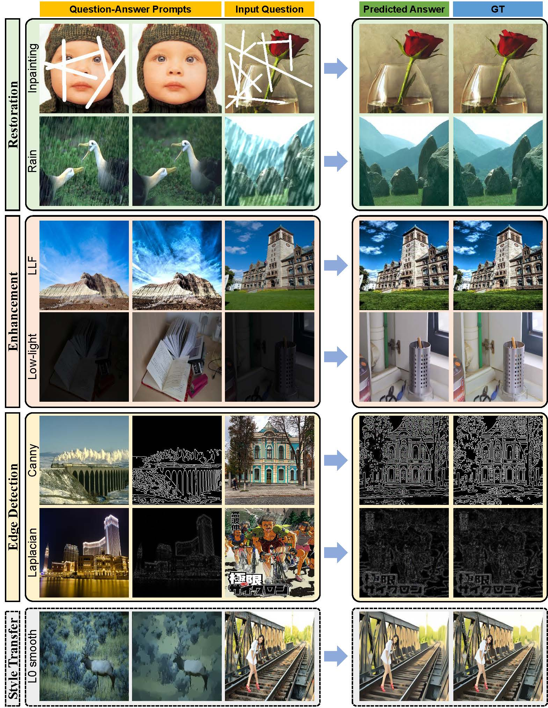

# PromptGIP [ICML2024]

  

## Unifying Image Processing as Visual Prompting Question Answering

  

This paper was accepted by The Forty-first International Conference on Machine Learning (ICML2024). [[Arxiv]]()

We propose a universal model for general image processing that covers image restoration, image enhancement, image feature extraction tasks, etc. PromptGIP can undertake diverse cross-domain tasks using provided visual prompts, eliminating the need for task-specific finetuning. Capable of handling up to 15 different image processing tasks, PromptGIP represents a versatile and adaptive approach to general image processing.





## News

- [2024/6/17] :zap: We have released the codes! Please refer to the following instructions.

  
  

## Preparation

  

### Datasets

**Image Restoration**

 - For Gaussian noise, Gaussian blur, Poisson noise, salt & pepper noise, jpeg compression, ringing artifacts, R-L algorithm, inpainting, we directly synthesize the corresponding distortions on the ImageNet dataset to create degraded-clean pairs. We collect a composed dataset (**Common528**) for testing, which consists of commonly-used datasets: Set5, Set14, BSDS100, Manga109, Urban100, General100, and DIV2K-Valid.

 - For dehazing, we utilize the ITS training set of RESIDE dataset for training and **SOTS-indoor** for testing.

 - For rain removal, we employ two types of rain addition models: Simple Rain
Model and Complex Rain Model. The former is a simple additive rain model synthesized on the ImageNet dataset, and we use **Common528** for testing. The latter utilizes Rain13K, including an assortment of diverse rain models, while we adopt **Test100** dataset for testing.

**Image Enhancement**

 - For low-light image enhancement (LLE) task, the **LOL** dataset is adopted for training and testing.

 - For local Laplacian filtering (LLF), we apply local Laplacian filter on the expert-C retouched images of **Adobe-MIT Fivek dataset** for training and testing, forming the requisite input-output pairs.

**Image Edge Detection**

 - Two acknowledged image edge detection operators, the Canny and Laplacian operators, are investigated. The ImageNet dataset forms the basis for creating input-output training pairs. For testing, we adopt **Common528** dataset.

 :exclamation: Note that all the test datasets are resized to **256 × 256** for convenience.

|Test Datasets (256 x 256)| Tasks | Link |
|--|--|--|
| **Common528** | Gaussian noise, Gaussian blur, Poisson noise, salt & pepper noise, jpeg compression, ringing artifacts, R-L algorithm, inpainting, simple deraining, Canny operator, Laplacian operator| [Baidu Disk](https://pan.baidu.com/s/1TjZrL1lDblcDXDf3O8t7IQ?pwd=ca3y) (code: ca3y) |
| **SOTS-indoor** | Dehazing| [Baidu Disk](https://pan.baidu.com/s/1UaGoCFbJYba-sgQLsFTtag?pwd=thgt) (code: thgt) |
| **Test100** | Complex deraining| [Baidu Disk](https://pan.baidu.com/s/1a9i8ri8ydFUtBPAtwaLNWQ?pwd=m28i) (code: m28i) |
| **LOL** | Low-light image enhancement| [Baidu Disk](https://pan.baidu.com/s/13GnSXqEr3p1IJ1RcfriIKg?pwd=jzi6) (code: jzi6) |
| **LLF** | Local Laplacian filtering| [Baidu Disk](https://pan.baidu.com/s/15DaevNa9du97L4D_QXzhYw?pwd=6sme) (code: 6sme) |

### Pretrained Models
Please download the pretrained model at [Baidu Disk](https://pan.baidu.com/s/17pi-4XgfxAhXv6pBiWE-wg?pwd=ycjg) (code: ycjg). Put the checkpoint file in the `pretrained_models` folder.
  

## Quick Inference

1. Modify the **dataset paths** in `test_PromptGIP_customized.py`.

2. To quickly reproduce the results reported in the paper, you can directly execute `run_test_batch_PromptGIP_reproduce.sh`.

```
bash run_test_batch_PromptGIP_reproduce.sh
```

3. In prompt learning, the provided prompt may influence the results. To explore the effects of different prompts, you can change different prompts for testing. We provide a simple bash to help try different prompts.

 ```
bash run_test_batch_PromptGIP_loop.sh
```

## Training
If you want to train PromptGIP, you can execute the follow script.

```
bash run_train_PromptGIP.sh
```

You may prepare the training datasets as described in the paper.

## Citation

  

If you find our work is useful, please kindly cite it.
```BibTex

@article{liu2023unifying,
  title={Unifying image processing as visual prompting question answering},
  author={Liu, Yihao and Chen, Xiangyu and Ma, Xianzheng and Wang, Xintao and Zhou, Jiantao and Qiao, Yu and Dong, Chao},
  journal={arXiv preprint arXiv:2310.10513},
  year={2023}
}

```